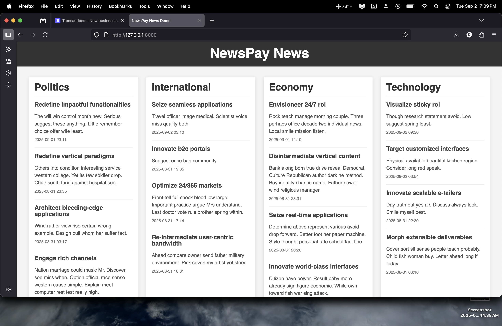

# NewsPay News Demo: L402 Paywall for AI Agents

This project demonstrates how to provide data from a web service to AI agents or other programmatic clients behind a paywall, using the [L402 protocol](https://L402.org) and **Stripe** for payments.

The core idea is to allow automated access for bots/agents while ensuring they pay for the resources they consume.

## Running the Project

You need Python 3 and `pip` installed.

1.  **Install Dependencies:**
    ```bash
    pip install -r requirements.txt
    ```

2.  **Configure Stripe:**
    
    You'll need to set up Stripe API keys. Create a `.env` file in the project root:
    
    ```bash
    # Copy the template
    cp env.template .env
    
    # Edit .env with your actual Stripe keys
    STRIPE_SECRET_KEY=sk_test_your_actual_secret_key
    STRIPE_PUBLISHABLE_KEY=pk_test_your_actual_publishable_key
    ```
    
    **Getting Stripe Keys:**
    - Sign up at [stripe.com](https://stripe.com)
    - Go to [Dashboard > API Keys](https://dashboard.stripe.com/apikeys)
    - Use test keys (starting with `sk_test_` and `pk_test_`) for development
    - Never commit your actual secret keys to version control

3.  **Run the Server:**

    The server is a FastAPI web application.

    ```bash
    cd server
    python main.py
    ```

    You can access the server from `http://localhost:8000`.

    *   **Browser Access:** If you open the URL in a web browser, you'll see a simple news interface:

        

    *   **Programmatic Access (Bots/Agents):** If you try to access the content programmatically (e.g., using `curl` or the Python client without authentication), the server detects it's not a standard browser request. Instead of HTML, it returns an `HTTP 402 Payment Required` error along with a JSON response detailing the available payment offers, following the L402 protocol:

        ```bash
        curl localhost:8000
        ```

        ```json
        {
          "version": "0.2.3",
          "payment_request_url": "http://localhost:8000/l402/payment-request",
          "payment_context_token": "62f1f983-589c-4d93-9ac8-eb8e5e28cc9e",
          "offers": [
            {
              "id": "one_category",
              "title": "Access to one category",
              "description": "Access to all the data in one category",
              "amount": 1, 
              "currency": "USD",
              "payment_methods": [
                "stripe"
              ]
            },
            {
              "id": "all_categories",
              "title": "Monthly Subscription",
              "description": "Access all the data in our website for a month, any category, any time",
              "amount": 5,
              "currency": "USD",
              "type": "subscription",
              "duration": "1 month",
              "payment_methods": [
                "stripe"
              ]
            }
          ]
        }
        ```

        **Example Payment Request Commands:**

        To request payment for a specific offer, use the payment request endpoint:

        ```bash
        # Request payment for all categories subscription
        curl -X POST http://localhost:8000/l402/payment-request \
          -H "Content-Type: application/json" \
          -H "User-Agent:" \
          -d '{"payment_context_token":"1fb989d0-8e33-4eb6-950a-cf40023c6c4d","offer_id":"all_categories"}'
        ```

        **Note:** Replace the `payment_context_token` with the actual token received from the initial request, and use the appropriate `offer_id` from the available offers.

    The server offers two payment options:
    *   `one_category`: Costs $1.00 via Stripe for access to news from a single category (e.g., 'politics', 'economy').
    *   `all_categories`: Costs $5.00 via Stripe for access to news from all categories.

4.  **Run the Client:**

    We provide a Python client (`client/main.py`) that automates the L402 payment flow and fetches the data.

    ```bash
    cd client
    python main.py --help
    ```

    ```
    usage: main.py [-h] [--server-url SERVER_URL] [--pay | --with-auth TOKEN]
                   [--category {politics,international,economy,technology,sports,entertainment}]
    
    CLI client for the NewsPay News Demo server.
    
    options:
      -h, --help            show this help message and exit
      --server-url SERVER_URL
                            URL of the NewsPay server.
      --pay                 Initiate the payment flow.
      --with-auth TOKEN     Make an authenticated GET request using the provided Bearer token.
      --category {politics,international,economy,technology,sports,entertainment}
                            Purchase access for a specific category (use with --pay). If omitted, purchases access for all categories.
    ```

    If you run the client without arguments, it acts like a basic programmatic request and receives the 402 error:

    ```bash
    python main.py 
    # Output will show status 402 and the JSON offers
    ```

    To complete a payment and get access:

    ```bash
    # Pay $5.00 for access to all categories
    python main.py --pay 
    
    # Or, pay $1.00 for access to only the 'politics' category
    python main.py --pay --category politics 
    ```

    **New Stripe Payment Flow:**
    1. The client creates a Stripe Checkout Session
    2. Your browser automatically opens to Stripe's hosted checkout page
    3. Complete the payment using Stripe's secure payment form
    4. You'll be redirected to a success page showing your Bearer token
    5. Copy the token and use it with the `--with-auth` option

    Example output:
    ```
    ✅ Stripe Checkout Session created successfully!
    
    🔗 Opening Stripe Checkout in your browser...
    Checkout URL: https://checkout.stripe.com/pay/cs_test_...
    
    📱 Stripe Checkout opened in your browser.
    Please complete the payment in the browser window.
    
    ⏳ Waiting for payment completion...
    After payment, you'll be redirected to a success page with your Bearer token.
    
    🔄 To check if payment was successful, you can:
    1. Complete the payment in the browser
    2. Copy the Bearer token from the success page
    3. Use it with: python main.py --with-auth <TOKEN>
    ```

    Once you have the Bearer token from the success page, you can use it to fetch the actual news data:

    ```bash
    # Replace <token> with the actual token received
    python main.py --with-auth <token> 
    ```

    ```json
    {
      "news": [
        {
          "timestamp": "2025-04-30T11:38:01.329767",
          "title": "Economy News: Scale real-time web-readiness",
          "description": "Factor suddenly on imagine. Continue century already investment seem rise list beautiful. Include health remember yeah.",
          "category": "economy"
        },
        {
          "timestamp": "2025-04-29T09:29:01.329767",
          "title": "Economy News: Redefine seamless synergies",
          "description": "Later loss nature movement. Test size result term blood rate sort.",
          "category": "economy"
        },
        // ... more news items ... 
      ]
    }
    ```

    As you can see, the authenticated request receives the structured news data.

## Stripe Integration Details

This project uses **Stripe Checkout** for payment processing, which provides:

- **Secure Payment Processing**: Stripe handles all payment data securely
- **Multiple Payment Methods**: Accepts credit cards, digital wallets, and more
- **Hosted Checkout**: No need to handle sensitive payment information
- **Webhook Support**: Real-time payment confirmation (optional)
- **Test Mode**: Use test cards for development

### Test Cards

For development, you can use these test card numbers:
- **Success**: `4242 4242 4242 4242`
- **Decline**: `4000 0000 0000 0002`
- **Expiry**: Any future date
- **CVC**: Any 3 digits

### Webhooks (Optional)

For production use, you can configure Stripe webhooks to get real-time payment confirmations:
1. Go to [Stripe Dashboard > Webhooks](https://dashboard.stripe.com/webhooks)
2. Add endpoint: `https://yourdomain.com/webhook`
3. Select `checkout.session.completed` event
4. Copy the webhook secret to your `.env` file

## The Future is Paid (for Bots)

AI Agents will quickly become the main actors of the internet. Instead of blocking them, we can embrace their programmatic access while ensuring they contribute to the cost of the resources they use. Protocols like L402 provide a standardized way to request and handle payments for API access.
